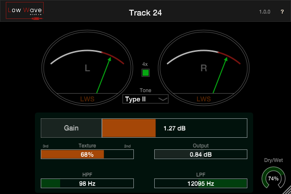

# Track24
Analog Tape / Saturator 

Track24 is neither a Tape Emulation, nor a simple Saturator. It behaves like Analog Tape but without its “downsides”. It doesn’t care about Flutter, Wow or Noise, but it has the Tone and Saturation characteristics of Tape, plus other extra functionality.

- Features a Tape Saturation section with a variable Texture control to add more 2nd or 3rd order harmonics;
- A Tone section with 4 filter “presets” that were inspired by 2 different tape machines, running at different Ips – with “Neutral” being a completely flat;
- 4x oversample button to avoid aliasing – adds a tiny bit of latency;
- High and Low pass filters that are pre-saturation. To shape the incoming signal;
- A Dry/Wet knob to mix the clean with the saturated signal.

Made using the JUCE framework

These plugins are free to use and I make them on my spare time. If you like them and are able to help by becoming a Patreon member, I would be very grateful.
[Patreon](https://www.patreon.com/lowwavestudios)

